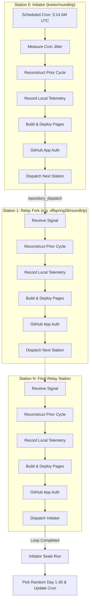

# System Architecture

## 1. Overview

**Roundtrip** is a decentralized, cyclic workflow orchestration benchmark distributed across distinct GitHub accounts. It measures and visualizes the operational lifecycle of GitHub Actions runner scheduling, execution durations, build/deployment pipelines, and cross-account event propagation.

---

## 2. The Station Relay Lifecycle

Every participating repository represents a **Station** in a closed directed ring graph:
$$\text{Station}_0 \rightarrow \text{Station}_1 \rightarrow \dots \rightarrow \text{Station}_{N-1} \rightarrow \text{Station}_0$$

Each execution follows a strictly ordered state machine:

### Phase 1: Ingestion & Timing Inception
1. **Trigger Ingestion**:
   - **Station 0 (Initiator)** is triggered automatically once per month via a GitHub Actions scheduled cron job configured for `14 3 <D> <M> *` (03:14 UTC).
   - **Intermediate Stations ($k > 0$)** are triggered via a `repository_dispatch` webhook event (`roundtrip_signal`) sent from Station $k-1$.
2. **Jitter Calculation**:
   - For Station 0, the runner computes the delta between the scheduled time ($T_{\text{sched}} = 03:14:00Z$) and the actual step initialization time ($T_{\text{init}}$):
     $$\Delta_{\text{jitter}} = T_{\text{init}} - T_{\text{sched}}$$
   - For intermediate stations, the dispatch latency is measured against the dispatch timestamp emitted by the preceding station:
     $$\Delta_{\text{dispatch\_lag}} = T_{\text{received}} - T_{\text{dispatched\_prev}}$$

### Phase 2: Prior Round Reconstruction
Before propagating the signal to the next station, each station reconstructs the trajectory of the **previous complete round**:
1. It queries the public telemetry endpoint (published on GitHub Pages or raw git repository) of its configured downstream neighbor (`next_station`).
2. It traces backward hop-by-hop from the downstream neighbor through intermediate nodes back to Station 0, and back to itself.
3. It detects whether the previous cycle completed cleanly or broke prematurely at a specific station.
4. It records the reconstructed round metadata locally.

### Phase 3: Telemetry Recording
The station appends its run execution metrics to the local data store (`data/runs.json`):
- Station identity, round ID, and sequence index.
- Precise timestamps: `received_at`, `workflow_started_at`, `build_started_at`, `build_completed_at`, `dispatched_at`.
- Calculated delays: Runner queue wait time, build duration, and cumulative round elapsed time.

### Phase 4: Interface Build & Deployment
The station builds its Vite + React dashboard displaying interactive Gantt charts and topology health, and deploys it directly to GitHub Pages:
- The build artifact bundles the updated telemetry.
- **Inviolable Invariant**: The next station is **only** triggered after the Pages deployment step confirms success (`conclusion: success`). This guarantees that whenever any station inspects another station's public endpoint, the data is already live.

### Phase 5: Downstream Dispatch via GitHub App
1. The workflow authenticates as the shared **Roundtrip GitHub App** using its private key and app ID.
2. It requests an installation token for the downstream target repository.
3. It posts a `repository_dispatch` event with payload schema to `https://api.github.com/repos/{next_station_repo}/dispatches`.

### Phase 6: Loop Completion & Next Month Rescheduling (Initiating Station)
When the station that initiated the cycle receives the returning dispatch (`payload.initiator.repo == github.repository`):
1. It validates that the round ID matches the active cycle and marks the round status as `COMPLETED`.
2. It seals total round duration metrics and commits the final telemetry to its telemetry branch.
3. If scheduled cron runs are enabled, it generates a pseudorandom integer $D \in [1, 30]$ for the next calendar month.
4. It dynamically updates `.github/workflows/roundtrip.yml` with cron expression `14 3 <D> <M+1> *` and commits the schedule update.

---

## 3. Security Architecture: GitHub App Model

### Why GitHub App Over Personal Access Tokens
Using Personal Access Tokens (PATs) across a multi-user ring creates severe maintenance and security hazards:
- PATs expire and break the automated loop.
- PATs grant excessive broad account-wide permissions.
- PATs are tied to individual developer accounts rather than the shared system.

### App Setup & Delegation
1. A single **GitHub App** ("Roundtrip Relay") is created with minimal permissions:
   - **Repository Permissions**:
     - `Contents`: Read & Write (or `Actions`: Read & Write).
     - `Metadata`: Read.
2. Participating accounts install the app on their fork repository (`user/roundtrip`).
3. The App ID (`APP_ID`) and Private Key (`APP_PRIVATE_KEY`) are stored as GitHub Actions Secrets on each fork.
4. The GitHub Action workflow mints a short-lived token (valid for 60 minutes) at runtime to dispatch the downstream repository.

---

## 4. Failure Modes & Broken Loop Handling

| Failure Scenario | Detection Mechanism | Recovery / Mitigation |
|---|---|---|
| **Downstream Station Offline / 404** | GitHub App dispatch HTTP request fails (404/403/500). | Retry 3 times with exponential backoff; log failure in local database; mark status `BROKEN_LINK`. |
| **Pages Deployment Failure** | GitHub Pages deployment step exits with non-zero code. | Halt propagation; log deploy failure in telemetry; notify maintainer via workflow issue/annotation. |
| **Scheduler Omission by GitHub** | GHA cron fails to trigger on the scheduled day. | Jitter detection detects lag; manual fallback `workflow_dispatch` button provided on Station 0. |
| **Mid-Loop Infinite Loop / Desync** | Sequence hop limit exceeded ($\text{sequence} > 2 \times N$). | Workflow rejects dispatch payload if sequence counter exceeds maximum allowed hops; aborts recursion. |
