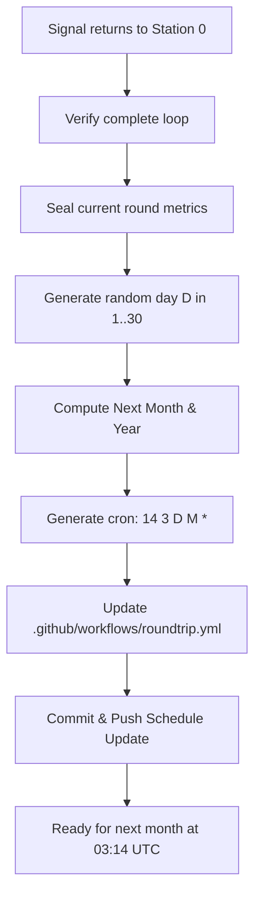

# Cron Scheduler & Dynamic Rescheduling

## 1. The 3:14 AM UTC Benchmark

The **Initiator Station** (Station 0, `kreier/roundtrip`) initiates the roundtrip cycle once per calendar month at **03:14 AM UTC**.

### Why 3:14 AM UTC?
3:14 is chosen as an homage to $\pi$ (3.14). Measuring runner startup times at this fixed minute across different days of the month provides empirical benchmarking data on GitHub Actions scheduler load and queue delays.

---

## 2. Cron Jitter Measurement

GitHub Actions scheduled workflows (`on.schedule`) execute on best-effort shared runners. During peak times, jobs may experience significant delay before a runner is allocated.

When Station 0 initiates:
1. **Scheduled Target**: Calculated as `YYYY-MM-DDT03:14:00.000Z`.
2. **Actual Startup**: Recorded at the very first step of the workflow runner using high-precision timestamps (`date --iso-8601=ns` or Node.js `performance.now()`).
3. **Jitter Metric**:
   $$\text{Jitter}_{\text{scheduler}} = T_{\text{actual}} - T_{\text{scheduled}}$$

This jitter metric is embedded directly into the round's payload trace and logged in `data/runs.json`.

---

## 3. Dynamic Monthly Day Election Algorithm

When the roundtrip completes and returns to Station 0:



### The Rescheduling Script (`scripts/calculate_schedule.py`)
```python
import datetime
import random
import re

def compute_next_schedule(current_date: datetime.date = None, target_time: str = None):
    today = current_date or datetime.date.today()
    # Advance to next month
    if today.month == 12:
        next_month = 1
        next_year = today.year + 1
    else:
        next_month = today.month + 1
        next_year = today.year

    # Pick random day between 1 and 30
    next_day = random.randint(1, 30)
    cron_expression = f"14 3 {next_day} {next_month} *"
    return next_day, next_month, next_year, cron_expression
```

### Workflow File Update Mechanism
The roundtrip workflow uses a dedicated step to update `.github/workflows/roundtrip.yml`:
1. Replaces the cron line in `roundtrip.yml`.
2. Commits the change with message:
   `chore(schedule): set next roundtrip start to YYYY-MM-DD at 03:14 UTC`.
3. Pushes to `main`.
