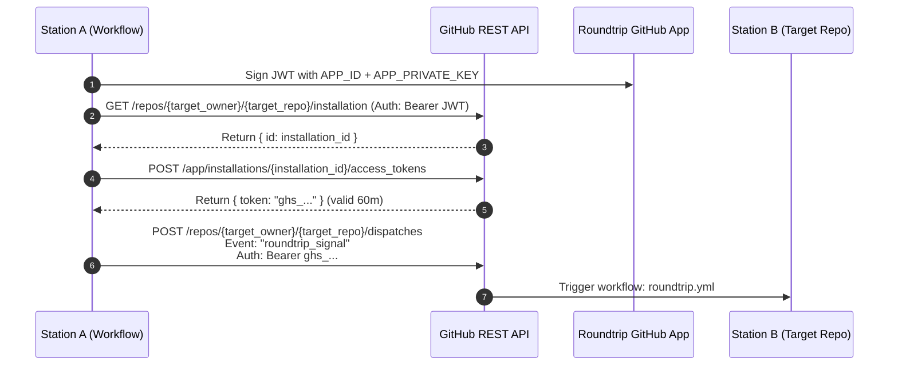

# Roundtrip Dispatch Protocol

## 1. Overview

The **Roundtrip Dispatch Protocol** governs how execution signals, telemetry traces, and timing records are transferred between stations across GitHub accounts.

Communication relies on GitHub's native `repository_dispatch` webhook endpoint, authenticated via installation access tokens generated by the **Roundtrip Relay GitHub App**.

---

## 2. GitHub App Authentication Handshake

Before Station $A$ can trigger Station $B$:



---

## 3. Dispatch Webhook Specification

- **Endpoint**: `POST https://api.github.com/repos/{owner}/{repo}/dispatches`
- **Headers**:
  ```http
  Accept: application/vnd.github+json
  Authorization: Bearer <github_app_installation_token>
  X-GitHub-Api-Version: 2022-11-28
  Content-Type: application/json
  ```
- **Body**:
  ```json
  {
    "event_type": "roundtrip_signal",
    "client_payload": { ... }
  }
  ```

---

## 4. `client_payload` Schema Specification

The `client_payload` object is passed into the triggered workflow via `${{ github.event.client_payload }}`:

```json
{
  "$schema": "https://json-schema.org/draft/2020-12/schema",
  "round_id": "RT-CRON-2026-10-14_03:14",
  "initiator": {
    "station_id": "kreier-station-0",
    "repo": "kreier/roundtrip",
    "trigger_type": "CRON",
    "scheduled_time_utc": "2026-10-14T03:14:00.000Z",
    "actual_start_utc": "2026-10-14T03:14:42.185Z",
    "cron_jitter_ms": 42185
  },
  "hop": {
    "sequence": 1,
    "dispatched_by_station": "kreier-station-0",
    "dispatched_by_repo": "kreier/roundtrip",
    "dispatched_at_utc": "2026-10-14T03:15:30.410Z",
    "target_station_repo": "offspring26/roundtrip"
  },
  "trace": [
    {
      "station_id": "kreier-station-0",
      "repo": "kreier/roundtrip",
      "sequence": 0,
      "received_at_utc": "2026-10-03T03:14:42.185Z",
      "completed_at_utc": "2026-10-03T03:15:28.910Z",
      "duration_ms": 46725,
      "pages_url": "https://kreier.github.io/roundtrip/",
      "pages_deployed_at_utc": "2026-10-03T03:15:26.500Z",
      "dispatched_next_at_utc": "2026-10-03T03:15:30.410Z"
    }
  ]
}
```

### Field Definitions

| Field Path | Type | Description |
|---|---|---|
| `round_id` | String | Unique identifier format `RT-YYYY-MM-DD-314` representing this monthly run. |
| `initiator.station_id` | String | Station identifier of the initiator. |
| `initiator.scheduled_time_utc` | String | The exact theoretical cron target time (ISO 8601 UTC). |
| `initiator.actual_start_utc` | String | Actual runner startup timestamp on Station 0. |
| `initiator.cron_jitter_ms` | Number | Milliseconds of scheduler latency on Station 0. |
| `hop.sequence` | Integer | Incremental counter of hops traversed (0 = Initiator). |
| `hop.dispatched_by_station` | String | Station ID sending this dispatch. |
| `hop.dispatched_at_utc` | String | Timestamp when the dispatch HTTP POST was sent. |
| `trace[]` | Array | Ordered collection of verified historical telemetry from all prior hops in this round. |

---

## 5. Security & Verification Rules

1. **Replay & Hop Ceiling Protection**:
   - Workflows must reject dispatches with `hop.sequence > MAX_HOPS` (default: 30) to prevent infinite loops from circular misconfigurations.
2. **Payload Schema Validation**:
   - If the incoming payload fails schema validation, the workflow halts with a descriptive error annotation.
3. **Previous Hop Identity Check**:
   - If `EXPECTED_PREVIOUS_STATION` is configured on the receiving station, it must match `hop.dispatched_by_station`.
